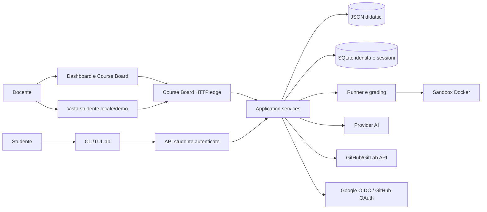
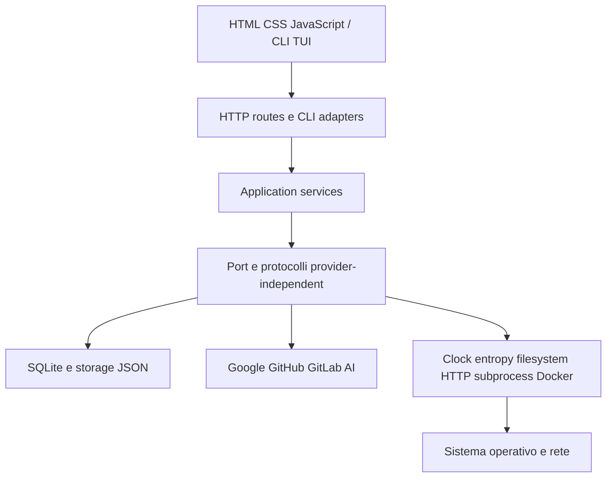
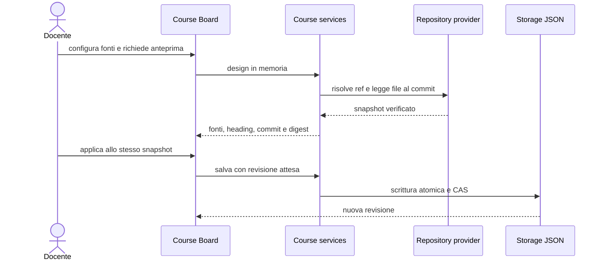
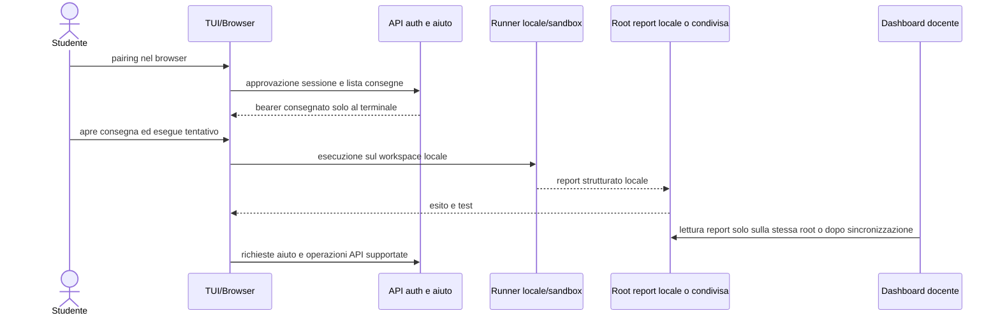
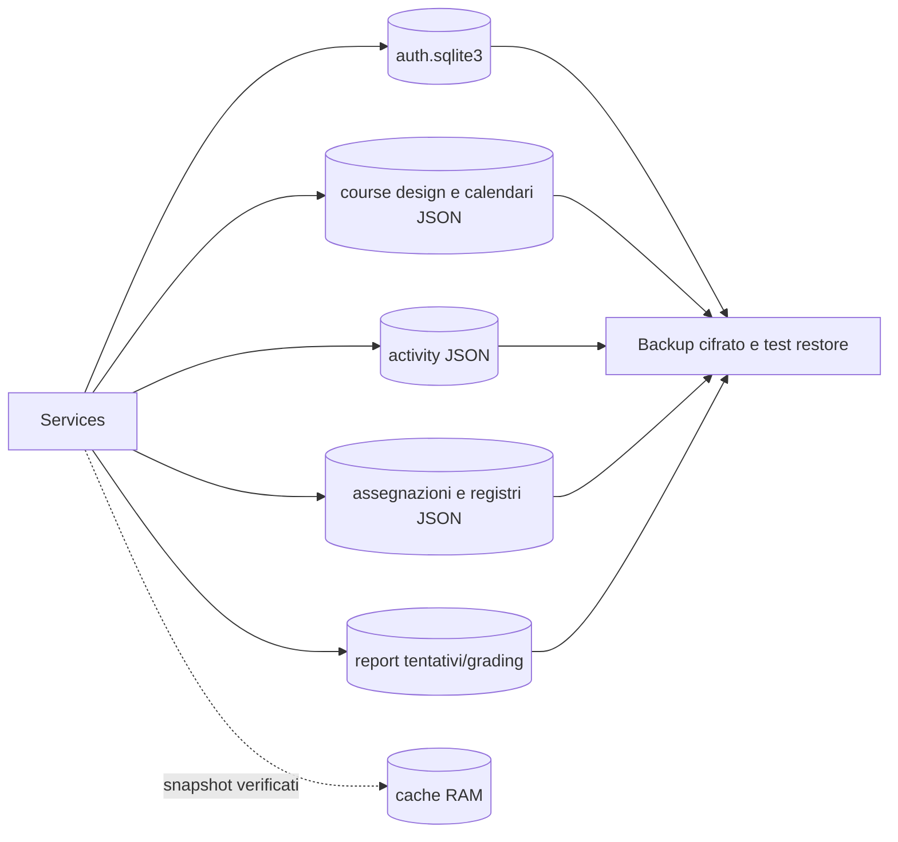

# Architettura discorsiva dell'MVP TheBitLab

## Destinatari e confini

Questo documento è la vista di insieme per sviluppatori e gestori del pilot. Le guide operative descrivono l'uso; gli ADR in `doc/architecture/` motivano le decisioni di sicurezza e storage. Per diagrammi visivi dettagliati di deployment, componenti e flussi HTTP vedi [`architecture/architecture-diagrams.md`](architecture/architecture-diagrams.md).

L'MVP è una singola installazione, inizialmente mono-scuola, con processi Python, frontend statici, SQLite per identità/sessioni e JSON per i dati didattici esistenti. Non è ancora un servizio orizzontalmente replicabile. La CLI/TUI è l'interfaccia studente autenticata; `student_dashboard.html` resta una vista locale docente/demo protetta da Basic docente, non un self-service federato.

## Visione generale

Il browser non contatta direttamente provider AI o repository privati. Il server mantiene le credenziali fuori dai design e restituisce soltanto dati necessari alla vista.

## Layer e dipendenze

Regole:

- UI e route traducono input/output, non decidono policy di dominio;
- i service applicano autorizzazione, CAS e transazioni;
- provider e storage implementano port esplicite;
- servizi tecnici isolano tempo, entropia, filesystem, rete e processi;
- token e segreti non attraversano contratti serializzati verso il browser.

Riferimenti: [servizi tecnici](architecture/technical-services.md), [service autenticazione](architecture/auth-application-services.md), [contratti dati](architecture/data-contracts.md).

## Flusso docente

Fonti remote, activity e calendario sono riferimenti a dati autorevoli. L'applicazione rifiuta risposte obsolete, commit cambiati e modifiche concorrenti.

## Flusso studente

Il bearer TUI resta in memoria e può essere revocato esattamente. Browser e terminale non si scambiano credenziali dell'altro canale. L'MVP non implementa ancora l'upload autenticato dei report di tentativo da una macchina studente separata: dashboard docente e selezione definitiva vedono i report soltanto quando condividono la root dati o quando un processo esterno li sincronizza. Un pilot distribuito deve definire questa sincronizzazione prima di considerare autorevoli tentativi e grading remoti.

## Dati e storage

SQLite contiene identità interne, ruoli, membership, sessioni, pairing e revoche. I JSON mantengono compatibilità con il materiale didattico e vengono protetti con validazione, revisioni e scritture atomiche. La cache contiene soltanto blob immutabili verificati e non sostituisce il controllo di autorizzazione provider.

## Autenticazione e autorizzazione

- Google OIDC stabilisce l'identità federata iniziale.
- GitHub OAuth collega un account ma non assegna autonomamente ruoli.
- `user_id` e `class_id` interni sono autorevoli.
- utenti nuovi iniziano `pending`;
- amministratori approvano ruoli e membership;
- sessioni web e TUI sono separate, scadono in UTC e possono essere revocate;
- route amministrative richiedono TLS trusted, sessione admin, CSRF, framing canonico e CAS.

Riferimenti: [ADR identità](architecture/adr-identity-auth-storage.md), [autorizzazione dashboard](architecture/dashboard-authorization.md), [pairing TUI](architecture/tui-browser-pairing.md).

## Repository e provenienza

Gli adapter GitHub/GitLab:

- usano origin API fissi e non seguono redirect;
- risolvono una ref una volta;
- leggono tutti i file tramite il commit risolto;
- verificano object ID, dimensione, Base64 e SHA-256;
- applicano deadline, slot e budget globali;
- accettano token soltanto da file esterni protetti.

Il runtime GitHub App genera installation token brevi e li ruota atomicamente. Source ID, provider, ref, commit e digest seguono il contenuto fino a preview, contesto AI e progetto generato.

Riferimenti: [catalogo fonti](COURSE_SOURCE_CATALOG.md), [repository provider](architecture/repository-providers.md).

## Bundle corsi e contenuti privati

I contenuti didattici (dispense, attività, lab, media) devono restare separati dalla piattaforma. L'architettura proposta li distribuirà come **bundle versionati** con manifest, indice, attività e materiali didattici. Fetcher e loader non sono ancora implementati; il target iniziale è un repo Git privato, con object storage/CDN in futuro.

Riferimenti: [ADR course bundle format](architecture/adr-course-bundle-format.md).

## AI e grading

Il grading deterministico usa una toolchain bloccata e può eseguire codice studente nella sandbox Docker senza segreti. I provider AI ricevono input bounded e contesto con provenienza verificata. Correzione, generazione e verifica sono mutuamente esclusive per snapshot; le risposte restano bozze finché il docente non le approva.

Riferimenti: [grading](ASSIGNMENT_GRADING.md), [sandbox](ASSIGNMENT_SANDBOX.md), [feedback AI manuale](MANUAL_AI_FEEDBACK_WORKFLOW.md).

## Deployment pilot

Configurazione iniziale raccomandata:

- una replica applicativa;
- reverse proxy HTTPS stabile;
- processo e directory segreti con utente dedicato;
- backup SQLite/JSON e prova periodica di restore;
- log senza token, cookie, callback o provider subject;
- monitoraggio di disponibilità, spazio disco, errori auth e code grading;
- callback OAuth registrate sul dominio stabile.

L'uso di stato OAuth in memoria impone una sola replica o sticky routing. Prima della replica orizzontale servono stato condiviso, PostgreSQL, Redis/queue, object storage, worker e tenancy esplicita.

## Tracciamento architetturale

Issue principali:

- [#282 — architettura madre](https://github.com/TheBitPoets/2cornot2c/issues/282)
- [#287 — GUI activity e registri](https://github.com/TheBitPoets/2cornot2c/issues/287)
- [#288 — interfaccia studente](https://github.com/TheBitPoets/2cornot2c/issues/288)
- [#289 — servizi tecnici, AI e Docker](https://github.com/TheBitPoets/2cornot2c/issues/289)
- [#290 — percorso, fonti, activity, UDA e calendario](https://github.com/TheBitPoets/2cornot2c/issues/290)
- [#535 — autenticazione federata](https://github.com/TheBitPoets/2cornot2c/issues/535)
- [#291 — closeout documentale](https://github.com/TheBitPoets/2cornot2c/issues/291)

## Limiti noti e direzione evolutiva

- mono-scuola e nessuna tenancy forte;
- SQLite e cache RAM locali;
- gestione classi ancora in parte manuale;
- nessun worker distribuito per grading/AI;
- nessuno snapshot store remoto condiviso;
- amministrazione e osservabilità da completare per produzione multi-scuola;
- GitLab usa token esterno ma non ha ancora un runtime equivalente al GitHub App runtime.

La direzione SaaS mantiene registrar, DNS/edge, hosting e provider identità/repository separabili.
