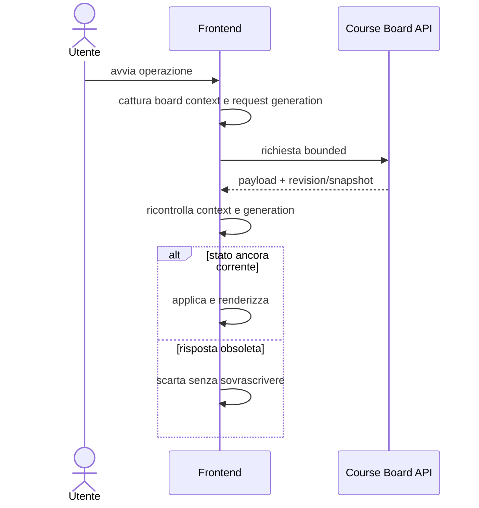

# Architettura frontend TheBitLab

## Confine

I frontend sono pagine statiche servite da `scripts/course_board_server.py`. Non contengono segreti e non accedono direttamente a provider repository, identità o AI. La Basic authentication della board docente resta un confine distinto dalle sessioni federate.

## File e pagine

| Pagina | HTML/CSS/JavaScript | Scopo |
|---|---|---|
| Course Board | `course_board.*` | fonti, UDA, activity, cornici, progetti |
| Calendario | `school_calendar.*` | eventi, orari, festività, Gantt |
| Dashboard docente | `assignment_dashboard.*` | classi, registri, grading, feedback |
| Dashboard studente | `student_dashboard.*` | consegne e feedback approvato |
| Amministrazione | componenti in `assignment_dashboard.*` | utenti pending, ruoli, membership |

`dashboard_dialogs.js` fornisce dialoghi, conferme e toast condivisi. Le pagine mantengono fallback leggibili senza dipendere da credenziali browser-side.

## Stato UI

La Course Board mantiene in memoria:

- design aperto e revisioni CAS;
- progetto corrente o nome archivio;
- catalogo fonti e heading;
- snapshot di pulizia per rilevare modifiche;
- operazioni asincrone in corso;
- richieste preview e generazioni per invalidare risposte obsolete;
- selezioni e preferenze non sensibili in local/session storage.

I token provider, bearer TUI, cookie e CSRF non appartengono allo stato applicativo serializzabile della board.

## Flusso asincrono

Pulsanti e form vengono disabilitati durante le sezioni critiche; firme della bozza e snapshot revision impediscono di applicare input modificati durante una verifica remota.

## Endpoint principali della Course Board

| Endpoint | Uso frontend |
|---|---|
| `GET /api/course-source-context` | design, fonti e heading coerenti |
| `POST /api/course-sources/preview` | preview fonti senza persistenza |
| `GET/POST /api/heading-content` | testo con commit e digest attesi |
| `GET/POST /api/course-design` | progetto corrente con CAS obbligatorio |
| `POST /api/saved-designs/save` | progetto archiviato o copia con nome |
| `GET /api/course-calendar-context` | calendario e revisioni coordinate |
| `GET /api/course-linkable-activities` | catalogo activity autorizzato |
| `POST /api/ai-frame` | cornice AI su provenienza verificata |
| `POST /api/ai-course-plan` | proposta percorso sullo snapshot corrente |

Le route amministrative e studente usano contratti e sessioni separati descritti in `doc/architecture/`.

## Course Board

Componenti principali:

- catalogo paragrafi con filtro fonte/livello/ricerca;
- preview del paragrafo con URL immutabile;
- editor provider-independent delle fonti;
- albero anni/UDA e drag/add accessibile;
- dialog collegamenti activity;
- cornici e comandi AI;
- menu progetti corrente/archiviati;
- operazioni calendario e salvataggio CAS.

La sincronizzazione fonti è in due fasi: preview non persistente e applicazione allo stesso snapshot. La persistenza è un'azione ulteriore e separata.

## Dashboard docente

La dashboard compone pannelli per:

- activity e assegnazioni;
- roster e classe;
- registri e copertura;
- grading, test e tentativi;
- richieste di aiuto;
- feedback AI in bozza/approvato;
- quadro classe, elenco e matrice;
- amministrazione autorizzata.

La logica di dominio rimane negli script/service Python; il JavaScript traduce form, filtri e viste.

## Dashboard studente e TUI

La dashboard mostra soltanto dati autorizzati per lo studente corrente. Il pairing TUI usa il browser per approvare il terminale, ma il bearer viene consegnato soltanto al client locale tramite il protocollo di pairing. Il frontend non lo salva.

## Errori e concorrenza

- `400`: input o schema non valido;
- `401/403`: autenticazione o autorizzazione insufficiente;
- `409`: revisione/snapshot obsoleto, da ricaricare;
- `413`: payload oltre i limiti;
- `429`: rate limit o risorsa satura;
- `502/504`: provider remoto rifiutato o fuori deadline.

La UI deve mostrare un errore sintetico senza includere token, cookie, provider subject o body remoti sensibili.

## Regole per modifiche future

1. Non aggiungere segreti a local/session storage.
2. Non chiamare provider dal browser.
3. Mantenere request generation e board-context check.
4. Ogni mutazione persistente deve avere CAS o snapshot atteso.
5. Aggiungere test frontend Node per logica pura e race.
6. Conservare tastiera, focus e fallback senza drag-and-drop.
7. Evitare duplicazione estraendo componenti condivisi solo quando il contratto è stabile.
8. Aggiornare questa mappa quando cambia un endpoint o la proprietà dello stato.
