# Scenari di test manuali GUI

Questa checklist raccoglie gli scenari manuali da ripetere quando si toccano dashboard docente, dashboard studente, calendario o flusso lab. Serve a riprodurre le prove fatte a mano in modo sempre uguale: stessi dati, stessi URL, stessi risultati attesi.

## Setup comune

Esegui i comandi dalla root del repository.

Gli scenari possono essere eseguiti singolarmente oppure in sequenza. Nell'esecuzione sequenziale lascia
attivo il server tra due scenari consecutivi, salvo quando un passaggio chiede esplicitamente di fermarlo
per cambiare root dati o configurazione. Nell'esecuzione singola applica prima il setup indicato dallo
scenario o, se non presente, questo setup comune.

Se la porta `8765` e gia occupata su Windows:

```powershell
Get-NetTCPConnection -LocalPort 8765 -ErrorAction SilentlyContinue | Select-Object LocalAddress,LocalPort,OwningProcess,State
Stop-Process -Id <PID> -Force
```

Prepara la root demo pulita:

```powershell
python scripts/student_lab_demo_setup.py
```

Avvia il server sulla root demo:

```powershell
python scripts/course_board_server.py --root tmp/student-lab-demo
```

Il server stampa le credenziali temporanee della dashboard. Al primo accesso nel browser inserisci l'utente
`teacher` e usa come password il token stampato; le stesse credenziali valgono per tutte le pagine web della demo.

URL principali:

- Dashboard docente consegne: `http://localhost:8765/tools/assignment_dashboard.html`
- Dashboard studente: `http://localhost:8765/tools/student_dashboard.html`
- Percorso docente: `http://localhost:8765/tools/course_board.html`
- Calendario docente: `http://localhost:8765/tools/school_calendar.html`

Dati demo principali:

- Studente: `rossi-mario`
- Activity: `python-demo-somma-001`
- Titolo activity: `Demo somma in Python`
- Classe: `3A-TPSI`
- Etichetta classe: `3A TPSI`
- Team GitHub: `team-3a-tpsi`
- Registro docente: `demo/python-demo-somma-001.json`

## Copertura manuale richiesta

Ogni pannello, modal, vista e comando deve avere almeno uno scenario manuale. Quando una voce cambia, aggiorna la riga corrispondente prima della review della PR.

| Area | Elemento | Scenario minimo | Automatizzabile |
| --- | --- | --- | --- |
| Dashboard docente | Genera registro / crea registro consegne | Seleziona activity, classe o assegnazione, crea registro e verifica feedback visibile | Playwright o Selenium |
| Dashboard docente | Registro selezionato | Carica `demo/python-demo-somma-001.json`, ricarica e verifica riepilogo | Playwright o Selenium |
| Dashboard docente | Studenti | Verifica riepiloghi, filtri attivi, righe studente e modal studenti | Playwright o Selenium |
| Dashboard docente | Quadro classe | Verifica viste `Elenco` e `Matrice`, filtri, bottoni consegna e righe compatte | Playwright o Selenium |
| Dashboard docente | Copertura registri | Verifica stato copertura, filtri e celle dense con nomi lunghi | Playwright o Selenium |
| Dashboard docente | Activity / wizard assegnazione | Crea o modifica activity, genera proposta AI, revisiona, assegna target e salva | Playwright o Selenium con mock API |
| Dashboard docente | Modal dettaglio consegna | Apri una consegna disponibile e verifica link/file/stato | Playwright o Selenium |
| Dashboard docente | Modal dettaglio errori | Usa un report fallito e verifica testo lungo leggibile | Playwright o Selenium |
| Dashboard docente | Modal AI feedback | Verifica approva, respingi, riapri bozza e persistenza dopo ricarica | Playwright o Selenium con API locale |
| Dashboard docente | Modal elenco/matrice | Apri modal grandi e verifica header, filtri, scroll e legenda | Playwright o Selenium |
| Dashboard studente | Riepilogo studente | Seleziona `rossi-mario` e verifica dati personali/lettura sola | Playwright o Selenium |
| Dashboard studente | Consegne | Verifica lista, badge prossima scadenza, mancanti e dettaglio consegna | Playwright o Selenium |
| Dashboard studente | Lab | Verifica workspace, report, test, ultimo tentativo e aiuti | Playwright o Selenium |
| Dashboard studente | Percorso | Verifica percorsi associati, UDA e link ai paragrafi GitHub | Playwright o Selenium |
| Dashboard studente | Calendario | Verifica mese/settimana/anno, lista/calendario, filtri, interruzioni e consegne | Playwright o Selenium |
| Percorso docente | Pannelli percorso/UDA/paragrafi | Verifica creazione/modifica contenuti e collegamenti | Playwright o Selenium |
| Calendario docente | Vista calendario | Verifica modalita, frecce, filtri, UDA programmate/reali e interruzioni | Playwright o Selenium |
| TUI studente | Lista consegne | Avvia TUI e verifica legenda, colori opzionali, date compatte e selezione numerica | Test interattivo o snapshot terminale |
| TUI studente | Dettaglio consegna | Apri una consegna e verifica sezioni, divisori, guida rapida e comandi | Test interattivo o snapshot terminale |
| TUI studente | Comando `e` | Esegui test e salva report con backend local e docker, poi verifica GUI studente/docente | Test interattivo piu assert su file |
| TUI studente | Comando `a` | Chiedi aiuto, verifica guida locale e storico, annulla con `b`/invio, valida input non valido | Test interattivo con input finto |
| TUI studente | Comando `h` | Mostra storico aiuti e torna alla consegna | Test interattivo con input finto |
| TUI studente | Comando `o` | Apre workspace se presente, mostra errore chiaro se assente | Test con mock apertura |
| TUI studente | Comandi `b`, `r`, `q` | Torna indietro, ricarica, esce senza perdere stato | Test interattivo con input finto |

Per l'automazione futura, la scelta piu naturale per le GUI web e Playwright, perche gestisce bene browser reali, screenshot e test responsive. Selenium resta possibile se vogliamo uno stack piu tradizionale. Per la TUI conviene partire da test con input finto e snapshot testuali, poi eventualmente passare a un harness terminale piu ricco.

I test GUI automatici vanno introdotti quando i punti di aggancio della UI sono abbastanza stabili, usando attributi espliciti come `data-testid` invece di selettori fragili basati sulla posizione. I test piu pesanti, soprattutto quelli con browser, screenshot, responsive e dati demo end-to-end, sono candidati per una suite notturna o manuale da lanciare quando la macchina non serve per lavorare.

## Collaudo completo con dati durevoli

Quando il flusso activity, assegnazione, consegna, lab e registro sara completo, eseguire tutti gli scenari di questo documento partendo da una root ricreata da zero. Non riutilizzare registri copiati da root temporanee di test: i riferimenti ai workspace devono appartenere alla root demo corrente.

1. Arresta il server che usa `tmp/student-lab-demo`.
2. Esegui `python scripts/student_lab_demo_setup.py` per ricreare dati coerenti e ripetibili.
3. Avvia nuovamente il server con `--root tmp/student-lab-demo`.
4. Esegui nell'ordine gli scenari TUI, dashboard studente e dashboard docente.
5. Verifica non soltanto la visibilita in GUI, ma anche che file, assegnazioni, report, aiuti e cancellazioni siano realmente persistiti o rimossi nella root dati.

## Scenario 1 - Dashboard studente con report riuscito

Obiettivo: verificare, come tester manuale, che lo studente veda la consegna corretta e tutti i dati del lab collegati: workspace, report, test, ultimo tentativo e aiuti.

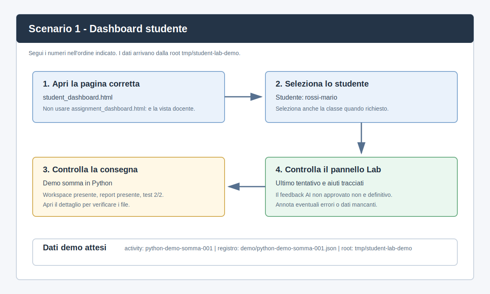

### Schermate reali della prova

La schermata annotata e stata catturata sulla dashboard reale usando la root `tmp/student-lab-demo`, lo studente `rossi-mario` e il viewport desktop `1440x1000`.

<table>
<tr>
<td valign="top" width="52%">

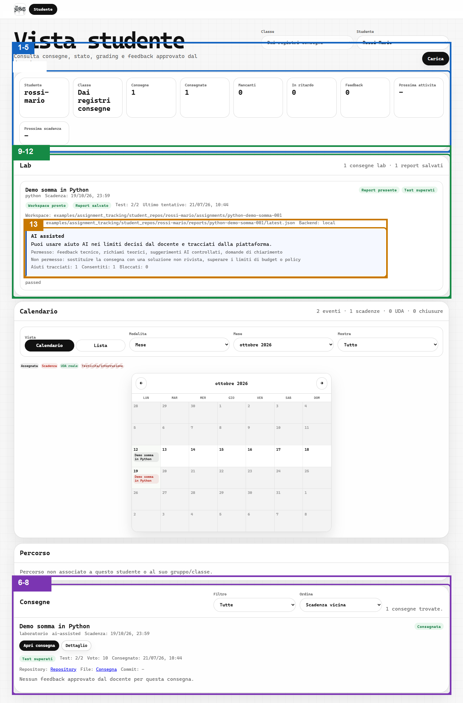

</td>
<td valign="top">

<strong style="color:#1464c0">Step 1-5 - Blu: apertura e selezione</strong><br>
<strong>1.</strong> Apri esattamente <code>http://localhost:8765/tools/student_dashboard.html</code>.<br>
<strong>2.</strong> Individua i filtri <code>Classe</code> e <code>Studente</code>.<br>
<strong>3.</strong> Seleziona la classe demo, se presente, quindi <code>rossi-mario</code>.<br>
<strong>4.</strong> Clicca <code>Carica</code>: la sola selezione non aggiorna i dati.<br>
<strong>5.</strong> Attendi il completamento del caricamento.<br><br>

<strong style="color:#7b35b2">Step 6-8 - Viola: consegna</strong><br>
<strong>6.</strong> Nel pannello <code>Consegne</code> cerca <strong>Demo somma in Python</strong>.<br>
<strong>7.</strong> Verifica stato completata/consegnata, non mancante.<br>
<strong>8.</strong> Controlla scadenza e indicazione del grading.<br><br>

<strong style="color:#168a45">Step 9-12 - Verde: dettaglio e test</strong><br>
<strong>9.</strong> Apri <code>Dettaglio</code> o <code>Apri consegna</code>.<br>
<strong>10.</strong> Verifica workspace e file, inclusi <code>main.py</code> e <code>tests/test_main.py</code> quando disponibili.<br>
<strong>11.</strong> Chiudi il modal e apri il pannello <code>Lab</code>.<br>
<strong>12.</strong> Controlla report, ultimo tentativo e risultato <code>2/2</code>.<br><br>

<strong style="color:#c87800">Step 13 - Arancione: aiuti e feedback</strong><br>
<strong>13.</strong> Verifica <code>Aiuti tracciati</code> e che il feedback AI non approvato non venga mostrato come definitivo.

</td>
</tr>
</table>

<details>
<summary>Evidenza Step 6-8: pannello Consegne con Demo somma in Python</summary>

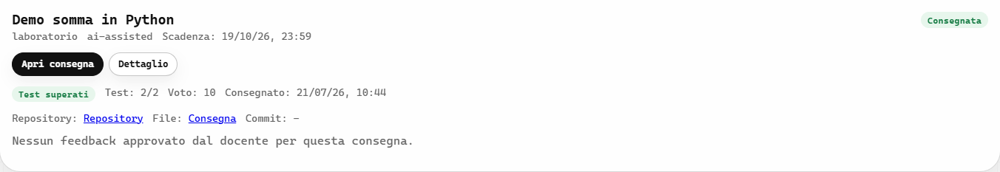
</details>

<details>
<summary>Evidenza Step 9-12: pannello Lab con workspace, report e test</summary>

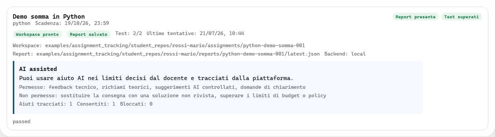
</details>

<details>
<summary>Evidenza Step 9-10: modal dettaglio della consegna e file</summary>

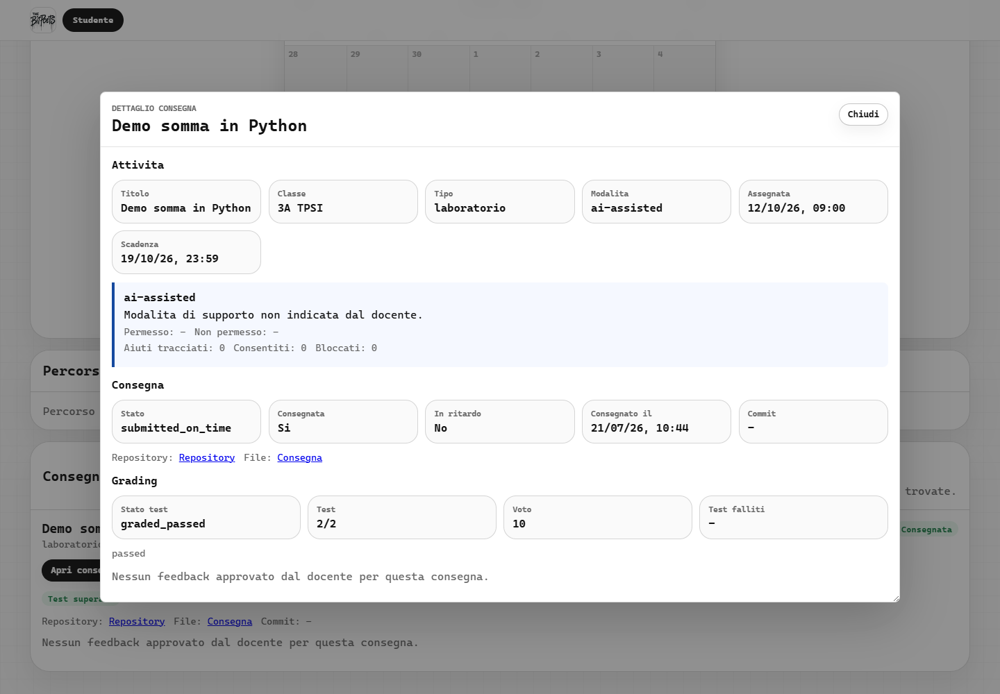
</details>

### Precondizioni

Esegui i comandi dalla root del repository. Se il server demo e gia attivo, non avviarne una seconda istanza.

```powershell
python scripts/student_lab_demo_setup.py
python scripts/course_board_server.py --root tmp/student-lab-demo
```

Il secondo comando resta attivo nel terminale. Usa un browser separato per la prova. Se compare una richiesta di autenticazione, inserisci l'utente `teacher` e il token stampato dal server.

### Da dove arrivano i dati

| Dato da controllare | Percorso nella root demo | Perche serve |
| --- | --- | --- |
| Activity | `tmp/student-lab-demo/activities/python-demo-somma-001.json` | Contiene titolo e istruzioni dell'esercizio |
| Assegnazione | `tmp/student-lab-demo/teacher-assignments/` | Collega activity, classe e studenti |
| Registro/report docente | `tmp/student-lab-demo/teacher-reports/demo/python-demo-somma-001.json` | Riassume stato, grading e test per ogni studente |
| Workspace | `tmp/student-lab-demo/examples/assignment_tracking/student_repos/rossi-mario/assignments/python-demo-somma-001/` | Contiene i file su cui lo studente lavora |
| Report lab | `tmp/student-lab-demo/examples/assignment_tracking/student_repos/rossi-mario/reports/python-demo-somma-001/latest.json` | Contiene l'ultimo risultato del runner |
| Aiuti | `tmp/student-lab-demo/teacher-help-events/` | Contiene gli eventi di richiesta aiuto |

### Procedura dettagliata

1. Apri esattamente `http://localhost:8765/tools/student_dashboard.html`.
   Non aprire `assignment_dashboard.html`: quella e la dashboard docente e mostra registri diversi.
2. Nella parte superiore individua i filtri `Classe` e `Studente`.
3. Seleziona la classe demo, se presente, quindi seleziona `rossi-mario`.
4. Clicca `Carica`: la selezione dello studente da sola non aggiorna i dati mostrati.
5. Attendi il completamento del caricamento. Non cambiare scheda durante il caricamento.
6. Nel pannello `Consegne` cerca il titolo esatto **Demo somma in Python**.
7. Verifica che la riga mostri uno stato di consegna completata o consegnata e che non sia indicata come mancante.
8. Controlla nella stessa riga la scadenza e l'eventuale indicazione del grading.
9. Apri `Dettaglio` o `Apri consegna` nella riga della demo.
10. Nel dettaglio verifica che il workspace risulti presente e che siano elencati i file dell'attivita, inclusi `main.py` e `tests/test_main.py` quando disponibili.
11. Chiudi il modal, torna alla vista della consegna e apri il pannello `Lab`.
12. Controlla il report, l'ultimo tentativo e il risultato dei test.
13. Verifica che gli aiuti tracciati siano valorizzati e che un eventuale feedback AI non approvato dal docente non venga mostrato come feedback definitivo.

### Risultato atteso

- La consegna visibile e **Demo somma in Python**, non `Somma in Python`.
- Il workspace risulta presente.
- Il report risulta presente.
- I test risultano passati: `2/2`.
- L'ultimo tentativo e valorizzato.
- Gli aiuti tracciati sono valorizzati.
- Il feedback AI non approvato dal docente non viene mostrato allo studente come feedback definitivo.

### Se il risultato non coincide

- Se vedi due consegne `Somma in Python`, controlla l'URL: probabilmente e aperta la dashboard docente.
- Se vedi `Demo somma in Python` ma senza dati, verifica che il server sia stato avviato con `--root tmp/student-lab-demo`.
- Se il server segnala che la root e gia in uso, non avviarne un altro: usa l'istanza gia attiva.
- Se il browser mostra una risposta precedente, esegui un hard refresh con `Ctrl+F5` e riseleziona `rossi-mario`.

### Evidenze da raccogliere

Per una prova manuale annota:

| Evidenza | Valore da riportare |
| --- | --- |
| URL usato | `student_dashboard.html` |
| Studente | `rossi-mario` |
| Activity visualizzata | `Demo somma in Python` |
| Workspace | presente/assente |
| Report | presente/assente |
| Test | `2/2` oppure valore osservato |
| Aiuti | numero visualizzato |
| Esito | superato / problema con descrizione |

Questi passaggi sono gia predisposti per una futura automazione Playwright: URL, studente, titolo activity e valori attesi possono diventare asserzioni; la schermata annotata puo essere usata come riferimento visivo durante la prova.

## Scenario 2 - Dashboard docente con registro demo

Obiettivo: verificare che il docente possa caricare il registro generato dalla demo lab.

### Schermata reale annotata

La cattura usa la root `tmp/student-lab-demo`, il registro `demo/python-demo-somma-001.json` e il viewport desktop `1440x1000`.

<table>
<tr>
<td valign="top" width="52%">

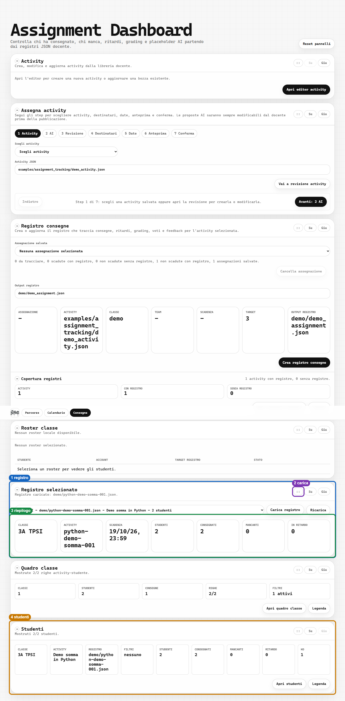

</td>
<td valign="top">

<strong style="color:#1464c0">Step 1-2 - Blu: registro selezionato</strong><br>
<strong>1.</strong> Apri <code>assignment_dashboard.html</code>.<br>
<strong>2.</strong> Nel pannello <code>Registro selezionato</code> individua il registro demo.<br><br>

<strong style="color:#7b35b2">Step 3 - Viola: caricamento</strong><br>
<strong>3.</strong> Clicca <code>Carica registro</code> e attendi il caricamento; usa <code>Ricarica</code> solo per rileggere i dati persistiti.<br><br>

<strong style="color:#168a45">Step 4 - Verde: riepilogo</strong><br>
<strong>4.</strong> Controlla classe, activity, studenti, consegnati, mancanti e ritardi.<br><br>

<strong style="color:#c87800">Step 5-8 - Arancione: vista studenti e consegna</strong><br>
<strong>5.</strong> Clicca <code>Apri studenti</code>.<br>
<strong>6.</strong> Verifica che il modal mostri lo studente corretto e i suoi indicatori.<br>
<strong>7.</strong> Nella riga di <code>rossi-mario</code>, clicca <code>Apri consegna</code>.<br>
<strong>8.</strong> Seleziona <code>main.py</code> e <code>test_main.py</code>.

</td>
</tr>
</table>

<details>
<summary>Evidenza Step 1-4: dashboard docente con registro caricato</summary>

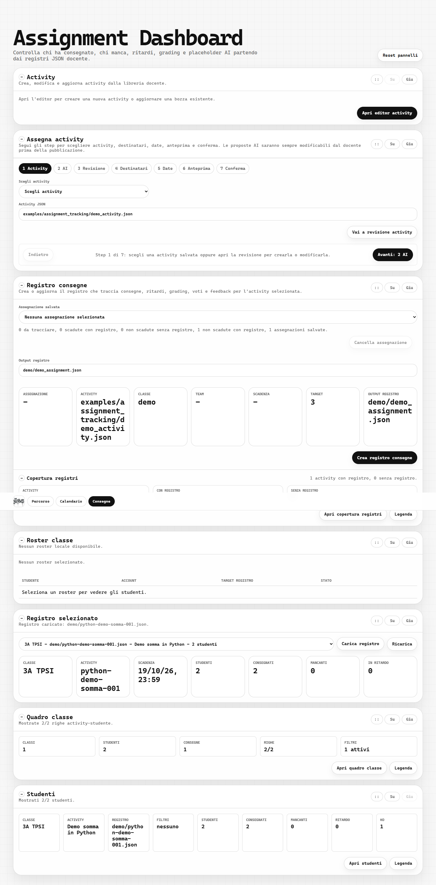
</details>

1. Apri `http://localhost:8765/tools/assignment_dashboard.html`.
2. Nel pannello del registro seleziona `demo/python-demo-somma-001.json`.
3. Clicca `Carica registro`.
4. Controlla i riepiloghi del registro selezionato.
5. Apri il pannello `Studenti`.
6. Apri il modal degli studenti, se disponibile.
7. Nella riga di `rossi-mario`, clicca `Apri consegna`.
8. Seleziona `main.py` e poi `test_main.py` dalla lista dei file.
9. Nel pannello `Genera registro consegne`, seleziona un'assegnazione e premi `Cancella assegnazione`.
   Controlla titolo e conseguenze nel dialog, quindi scegli `Mantieni`: questo scenario non deve cancellare
   i dati demo.

Risultato atteso:

- Il registro caricato mostra activity `Demo somma in Python`.
- Classe e team sono coerenti con `3A-TPSI` e `team-3a-tpsi`.
- Lo studente `rossi-mario` e presente.
- Lo stato consegna indica una consegna disponibile e tracciata.
- I test risultano `2/2`.
- Il backend report risulta locale.
- Le richieste di aiuto risultano visibili nel riepilogo docente.
- Il modal della consegna mostra il contenuto di `main.py` e `test_main.py` senza errori 404.
- I file aperti appartengono alla root demo corrente, non a una precedente cartella temporanea.
- La conferma di cancellazione è un dialog integrato nella pagina; `Mantieni` lo chiude senza rimuovere
  l'assegnazione e senza mostrare un `confirm()` nativo del browser.

## Scenario 3 - Quadro classe ed elenco consegne

Obiettivo: verificare che il quadro classe rimanga leggibile e che i bottoni aprano la consegna corretta.

### Schermata reale annotata

La cattura mostra il modal <code>Quadro classe</code> aperto sul registro demo, con filtri e righe reali di `rossi-mario` e `bianchi-luca`.

<table>
<tr>
<td valign="top" width="52%">

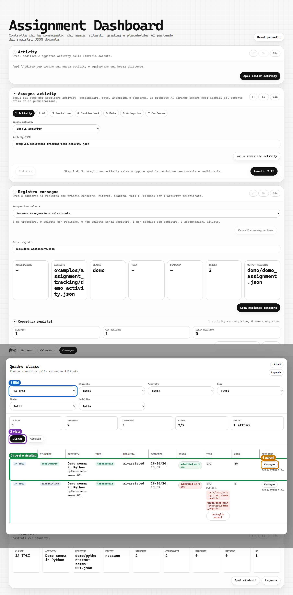

</td>
<td valign="top">

<strong style="color:#1464c0">Step 1-3 - Blu: apertura e filtri</strong><br>
<strong>1.</strong> Apri la dashboard docente.<br>
<strong>2.</strong> Carica <code>demo/python-demo-somma-001.json</code>.<br>
<strong>3.</strong> Controlla classe, studente, activity, tipo, stato e modalità.<br><br>

<strong style="color:#7b35b2">Step 4 - Viola: vista elenco</strong><br>
<strong>4.</strong> Seleziona <code>Elenco</code> e verifica che la tabella resti leggibile.<br><br>

<strong style="color:#168a45">Step 5 - Verde: risultato Rossi</strong><br>
<strong>5.</strong> Cerca <code>rossi-mario</code> e controlla consegna, stato, test <code>2/2</code> e voto.<br><br>

<strong style="color:#c87800">Step 6 - Arancione: azione</strong><br>
<strong>6.</strong> Clicca <code>Consegna</code> solo se abilitato e verifica che apra la consegna corretta.

</td>
</tr>
</table>

<details>
<summary>Evidenza Step 3-6: quadro classe, filtri, righe e azioni</summary>

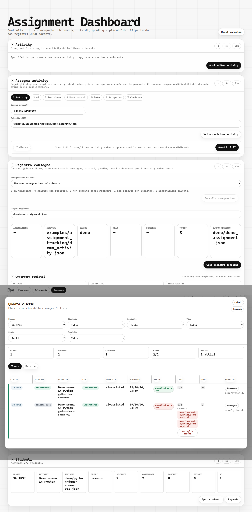
</details>

1. Apri `http://localhost:8765/tools/assignment_dashboard.html`.
2. Carica il registro `demo/python-demo-somma-001.json`.
3. Nel pannello `Quadro classe` controlla i filtri attivi.
4. Apri la vista `Elenco`.
5. Cerca la riga dello studente `rossi-mario`.
6. Usa il bottone `Consegna`, se abilitato.

Risultato atteso:

- Il filtro classe e coerente con il registro caricato.
- La riga resta compatta e non rompe l'altezza della tabella.
- Il bottone `Consegna` apre la consegna dello studente, non il registro generale.
- Se una consegna non ha link disponibile, il bottone resta disabilitato e la mancanza e indicata chiaramente.

## Scenario 4 - Richieste di aiuto visibili al docente

Obiettivo: verificare che il docente veda quante volte lo studente ha chiesto aiuto e il prompt inviato.

### Schermate reali della prova

La schermata annotata evidenzia il modal dedicato agli aiuti; la schermata completa sotto serve per
controllare testo, provider e contatori senza affidarsi soltanto al colore.

<table>
<tr>
<td valign="top" width="52%">

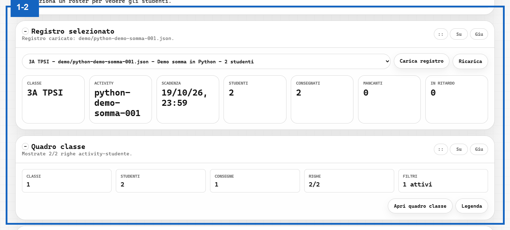


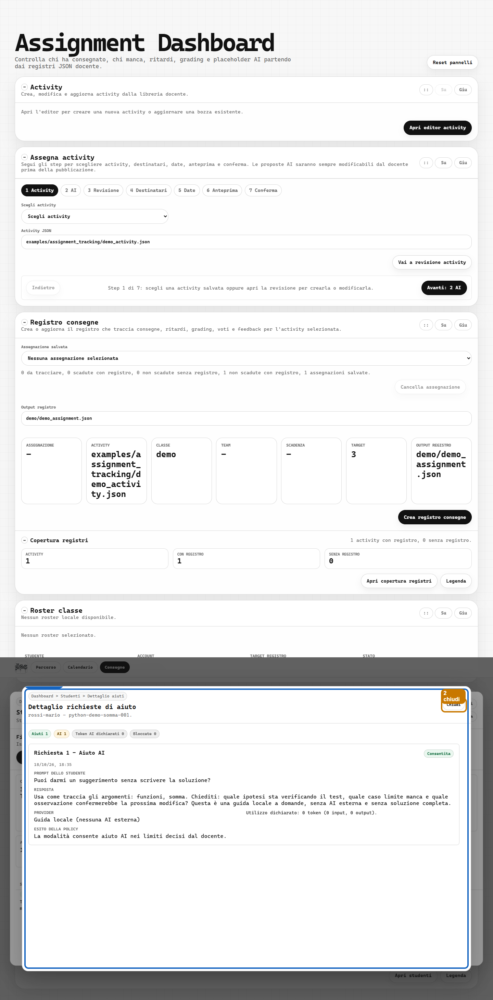

</td>
<td valign="top">

<strong style="color:#1464c0">Step 1-5 - Blu: selezione e riepilogo studente</strong><br>
Apri la dashboard docente, carica il registro, entra in <code>Studenti</code>, cerca <code>rossi-mario</code> e controlla riepilogo e contatori degli aiuti.<br><br>

<strong style="color:#1464c0">Step 6-8 - Blu: dettagli aiuti</strong><br>
<strong>1.</strong> Apri la dashboard docente e carica il registro demo.<br>
<strong>2.</strong> Apri <code>Studenti</code>.<br>
<strong>3.</strong> Cerca <code>rossi-mario</code>.<br>
<strong>4.</strong> Controlla il riepilogo degli aiuti.<br>
<strong>5.</strong> Verifica i contatori nella riga.<br><br>

<strong>6.</strong> Clicca <code>Dettagli aiuti</code>.<br>
<strong>7.</strong> Leggi prompt, risposta, provider e stato.<br>
<strong>8.</strong> Confronta i token dichiarati con il riepilogo.<br><br>

<strong style="color:#c87800">Step 9 - Arancione: chiusura</strong><br>
<strong>9.</strong> Chiudi il modal e verifica di restare nella stessa vista Studenti.

</td>
</tr>
</table>

<details>
<summary>Evidenza Step 6-8: dettaglio completo delle richieste di aiuto</summary>

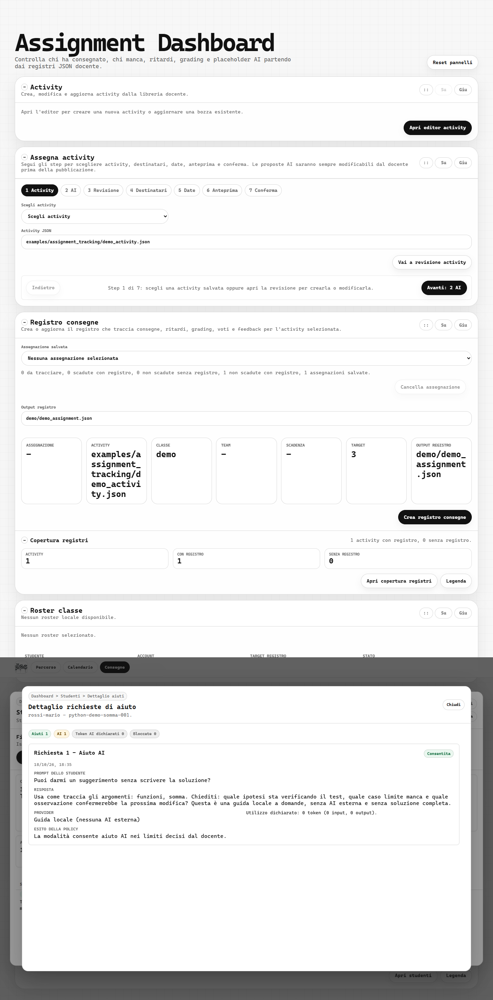
</details>

1. Apri `http://localhost:8765/tools/assignment_dashboard.html`.
2. Carica il registro `demo/python-demo-somma-001.json`.
3. Apri il pannello o modal `Studenti`.
4. Cerca `rossi-mario`.
5. Controlla il riepilogo dedicato agli aiuti.
6. Clicca `Dettagli aiuti`.
7. Leggi prompt, risposta, provider, stato e utilizzo dichiarato.
8. Controlla `Token AI dichiarati` nella cella, nel modal e nel riepilogo Studenti.
9. Chiudi il modal e verifica di tornare alla stessa vista Studenti.

Risultato atteso:

- Il docente vede `Aiuti 1`.
- Il docente vede `Aiuti AI 1`.
- La cella resta compatta e non mostra direttamente i prompt lunghi.
- `Dettagli aiuti` apre un modal dedicato.
- Il prompt demo è visibile nel modal: `Puoi darmi un suggerimento senza scrivere la soluzione?`.
- La risposta e il provider sono leggibili senza scorrimento orizzontale.
- Il totale `Token AI dichiarati` coincide con la somma dei contatori mostrati nelle richieste AI.
- Il riepilogo `AI senza contatori` coincide con gli avvisi presenti nelle righe studente.
- Eventuali risposte remote senza usage sono indicate come `Senza contatori` e non aumentano il totale.
- Gli aiuti bloccati sono `0`.

## Scenario 5 - Dettaglio errori test in modal

Obiettivo: verificare che un report fallito mostri gli errori in un modal leggibile, non in una linguetta troppo stretta.

### Schermate reali della prova

La cattura e stata ottenuta con il report demo che contiene un errore di test (fixture `bianchi-luca`). Il bordo arancione indica
il modal che deve contenere l'errore completo.

<table>
<tr>
<td valign="top" width="52%">


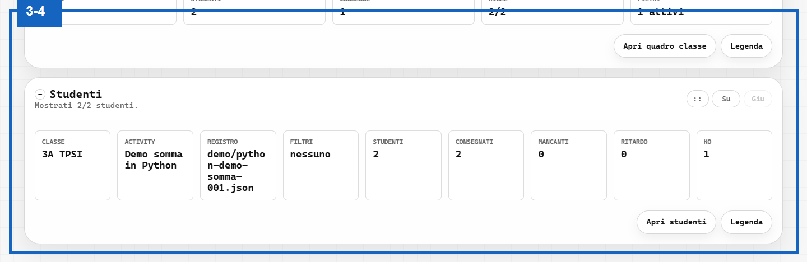

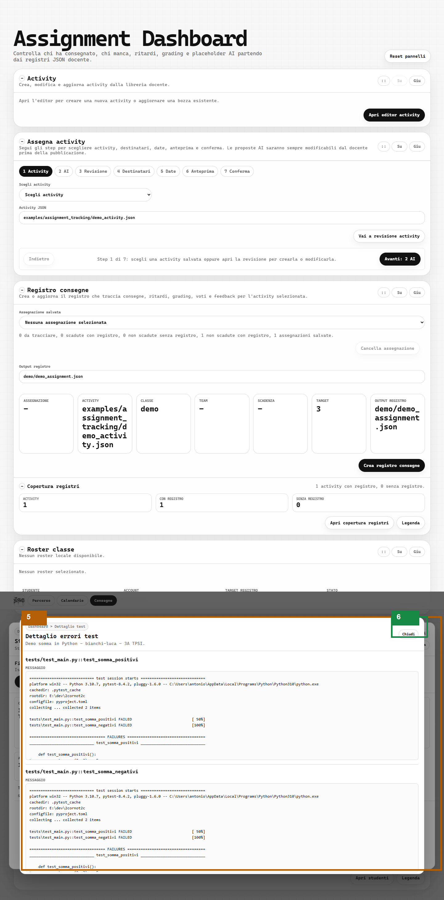

</td>
<td valign="top">

<strong style="color:#1464c0">Step 1-2 - Blu: registro</strong><br>
<strong>1.</strong> Apri la dashboard docente.<br>
<strong>2.</strong> Carica o ricarica il registro mutato.<br>
<br>
<strong style="color:#1464c0">Step 3-4 - Blu: selezione studente</strong><br>
<strong>3.</strong> Apri <code>Studenti</code>.<br>
<strong>4.</strong> Cerca <code>bianchi-luca</code>.<br><br>

<strong style="color:#c87800">Step 5 - Arancione: dettaglio</strong><br>
<strong>5.</strong> Clicca <code>Dettaglio errori</code> e verifica che il testo Python/pytest sia leggibile anche quando e lungo.<br><br>

<strong style="color:#168a45">Chiusura - Step 6 - Verde: ritorno</strong><br>
Chiudi il modal e verifica che la vista del registro resti invariata.

</td>
</tr>
</table>

<details>
<summary>Evidenza Step 5: modal con dettaglio errori Python/pytest</summary>

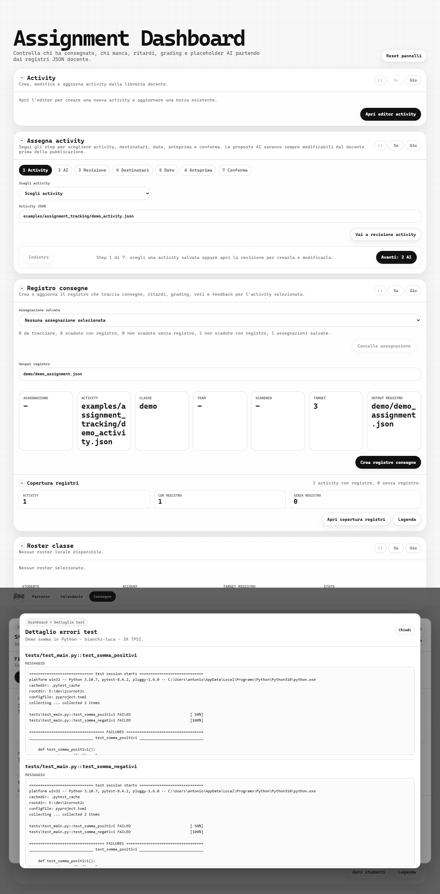
</details>

Prepara un errore intenzionale dopo il setup comune:

```powershell
$source = "tmp\student-lab-demo\examples\assignment_tracking\student_repos\bianchi-luca\assignments\python-demo-somma-001\main.py"
Set-Content -Path $source -Encoding utf8 -Value @("def somma(a, b):", "    return a - b")
python scripts/student_lab_runner.py --root tmp/student-lab-demo --student-id bianchi-luca --activity-id python-demo-somma-001 --write-report
python -m scripts.track_assignments --activity tmp\student-lab-demo\activities\python-demo-somma-001.json --target tmp\student-lab-demo\examples\assignment_tracking\student_repos\bianchi-luca --assigned-at 2026-10-12T09:00:00+02:00 --due-at 2026-10-19T23:59:00+02:00 --now 2026-10-18T18:30:00+02:00 --class-id 3A-TPSI --class-label "3A TPSI" --github-team team-3a-tpsi --output tmp\student-lab-demo\teacher-reports\demo\python-demo-somma-001.json
```

Poi:

1. Apri `http://localhost:8765/tools/assignment_dashboard.html`.
2. Carica o ricarica `demo/python-demo-somma-001.json`.
3. Apri `Studenti`.
4. Cerca `bianchi-luca`.
5. Clicca `Dettaglio errori`.

Risultato atteso:

- I test risultano falliti, per esempio `0/2`.
- Il bottone `Dettaglio errori` e visibile.
- Il dettaglio si apre in un modal.
- Il testo dell'errore Python o pytest e leggibile anche se lungo.
- Chiudendo il modal si torna alla stessa vista del registro.

Per tornare alla demo pulita:

1. Nel terminale in cui e in esecuzione il server premi `Ctrl+C` e attendi che il processo termini.
2. Rigenera i dati della demo:

```powershell
python scripts/student_lab_demo_setup.py
```

3. Riavvia il server sulla root rigenerata:

```powershell
python scripts/course_board_server.py --root tmp/student-lab-demo
```

4. Ricarica la dashboard nel browser prima di continuare con gli scenari successivi.

## Scenario 6 - Dashboard studente dopo esecuzione TUI

Obiettivo: verificare che un'azione fatta dalla TUI venga riflessa nella GUI studente.

### Schermata reale di riscontro

La schermata mostra il risultato che deve comparire dopo l'esecuzione del runner dalla TUI: report,
workspace, test e aiuti devono provenire dai dati persistiti.

<table>
<tr><td valign="top" width="52%">

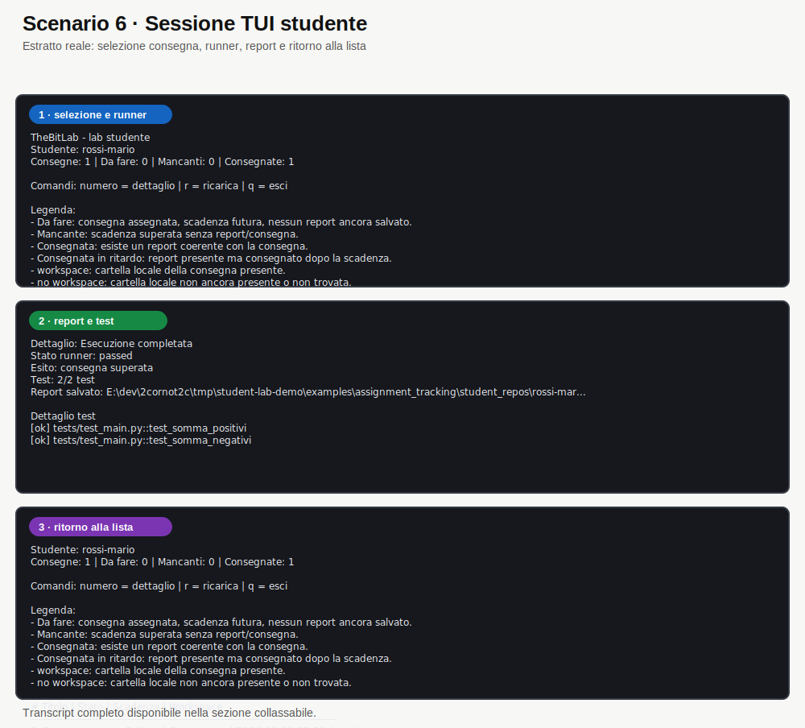

La cattura mostra un estratto reale della selezione consegna, del runner e del report. E stata acquisita
eseguendo la TUI sulla root demo corrente.

<details>
<summary>Evidenza completa Step 1-3: sessione TUI registrata</summary>

[Apri la traccia completa della sessione TUI](images/dashboard-guides/scenario-6-tui-session.txt)
</details>

</td><td valign="top">
<strong style="color:#1464c0">Step 1-3 - Blu: selezione ed esecuzione</strong><br>
Avvia la TUI, seleziona <code>Demo somma in Python</code> ed esegui il runner.<br><br>
<strong style="color:#168a45">Step 3 - Verde: report e test</strong><br>
Controlla nella TUI report, esito e test dell'esecuzione completata.<br><br>
<strong style="color:#7b35b2">Step 4-6 - Viola: ritorno e verifica GUI</strong><br>
Esci, apri la dashboard studente, seleziona <code>rossi-mario</code>, clicca <code>Carica</code> e confronta report, test, ultimo tentativo e aiuti con la TUI.
</td></tr>
</table>

1. Avvia la TUI:

   ```powershell
   python scripts/student_lab_cli.py --root tmp/student-lab-demo --student-id rossi-mario
   ```

2. Seleziona la consegna `Demo somma in Python`.
3. Esegui il runner con il comando indicato dalla TUI.
4. Esci dalla TUI.
5. Apri `http://localhost:8765/tools/student_dashboard.html`.
6. Seleziona `rossi-mario`.

Risultato atteso:

- La dashboard studente vede lo stesso report prodotto dalla TUI.
- Workspace, report, test e ultimo tentativo sono coerenti.
- Le richieste di aiuto registrate dalla TUI compaiono nella dashboard.

## Scenario 7 - Comandi TUI studente

Obiettivo: verificare che la TUI sia comprensibile, robusta sugli input e coerente con dashboard e report.

### Schermata annotata della procedura

La schermata riassume gli stessi passaggi descritti sotto: input non valido, dettaglio, aiuto, runner
locale e runner Docker. I colori dei blocchi corrispondono ai gruppi di passi della procedura.

<table>
<tr><td valign="top" width="52%">

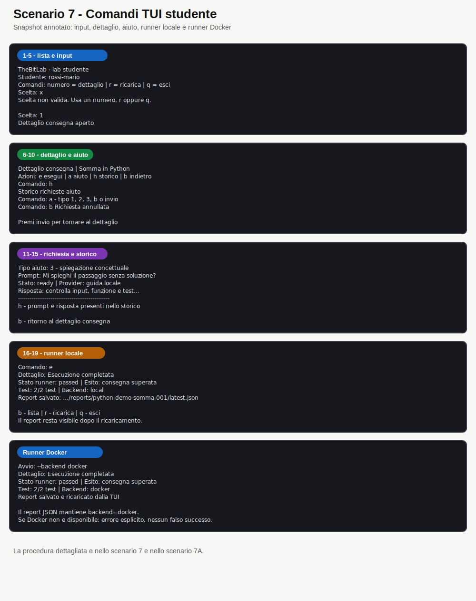

</td><td valign="top">
<strong style="color:#1464c0">Step 1-5 - Blu: lista e input</strong><br>
Avvia la TUI, prova un input non valido, seleziona la consegna con il numero e verifica che il dettaglio si apra.<br><br>
<strong style="color:#168a45">Step 6-10 - Verde: dettaglio e annullamento aiuto</strong><br>
Controlla le sezioni, apri lo storico, entra in aiuto e verifica che <code>b</code> e invio annullino senza creare richieste.<br><br>
<strong style="color:#7b35b2">Step 11-15 - Viola: richiesta e storico</strong><br>
Invia una richiesta consentita, controlla tipo, stato, risposta e presenza di prompt e risposta nello storico.<br><br>
<strong style="color:#b45f06">Step 16-19 - Arancio: esecuzione e navigazione</strong><br>
Esegui il runner, controlla report ed esito, poi usa <code>b</code>, <code>r</code> e <code>q</code>.<br><br>
</td></tr>
</table>

1. Se stai continuando dagli scenari precedenti, ferma con `Ctrl+C` il server avviato durante il setup
   comune. Prepara quindi di nuovo la demo e avvia il server docente con provider Codex:

   ```powershell
   python scripts/student_lab_demo_setup.py
   $env:THEBITLAB_STUDENT_HELP_PROVIDER="codex"
   $env:THEBITLAB_STUDENT_HELP_SECRET="demo-only-student-help-secret-change-me"
   python scripts/student_help_auth.py --student-id rossi-mario
   python scripts/course_board_server.py --root tmp/student-lab-demo
   ```

   Conserva il token studente stampato da `student_help_auth.py` per il passo successivo. Il server stampa
   separatamente il token dashboard docente: non usarlo nella TUI e non condividerlo con gli studenti.

2. In un secondo terminale avvia la TUI sulla stessa root:

   ```powershell
   $env:THEBITLAB_STUDENT_HELP_TOKEN="<token studente stampato da student_help_auth.py>"
   python scripts/student_lab_cli.py --root tmp/student-lab-demo --student-id rossi-mario --server-url http://127.0.0.1:8765
   ```

3. Nella lista iniziale controlla legenda, date compatte e stati.
4. Premi un valore non valido, per esempio `x`.
5. Seleziona la consegna con il numero.
6. Nel dettaglio controlla guida rapida, sezioni e divisori.
7. Premi `h`, leggi lo storico aiuti e torna indietro.
8. Premi `a`, poi `b`: la richiesta deve essere annullata.
9. Premi `a`, poi invio senza testo: la richiesta deve essere annullata.
10. Premi `a`, poi un tipo diverso da `1`, `2`, `3`, `b` o invio: deve comparire errore.
11. Premi `a`, scegli `3`, scrivi un prompt e invia la richiesta.
12. Controlla che l'esito immediato sia diviso da linee tratteggiate e mostri tipo, stato e risposta a capo. Con Codex operativo deve comparire `Codex locale (macchina docente)`.
13. Ferma il server, imposta `THEBITLAB_STUDENT_HELP_PROVIDER=local`, riavvialo e ripeti: deve comparire `Guida locale (nessuna AI esterna)`.
14. Premi `h` e verifica che prompt e risposta siano entrambi nello storico.
15. Ripeti con un URL o un identificatore lungo senza spazi e verifica che venga mandato a capo senza scorrimento orizzontale.
16. Premi `e` per eseguire test e salvare report.
17. Premi `b` per tornare alla lista.
18. Premi `r` per ricaricare.
19. Premi `q` per uscire.

Risultato atteso:

- Gli input non validi non eseguono azioni.
- `b` e invio annullano o tornano indietro dove previsto.
- Dopo un comando nel dettaglio si resta nel dettaglio della consegna, non si torna alla lista generale.
- Codex locale e la guida di fallback sono distinti dall'etichetta del provider e non mostrano una soluzione completa.
- La TUI segnala chiaramente quando il server non è raggiungibile e non salva direttamente l'evento sul client.
- L'esito immediato non ripete la motivazione della policy quando la richiesta riesce; per richieste bloccate o errori mostra subito il motivo.
- Prompt e risposta restano visibili nello storico della consegna.
- Ogni richiesta nello storico è separata da linee tratteggiate e prompt, risposta, motivo ed esito sono distinguibili per colore.
- Con `--no-color` la stessa gerarchia resta leggibile grazie a intestazioni, rientri e separatori.
- Il report salvato dalla TUI viene letto dalla dashboard studente.
- Le richieste di aiuto salvate dalla TUI vengono viste dal docente.
- Gli accenti e i testi italiani sono corretti.

### Scenario 7A - Runner TUI locale e Docker

Obiettivo: verificare separatamente il backend locale, il backend Docker, il report persistito e la coerenza
con la dashboard studente.

<table>
<tr><td valign="top" width="52%">

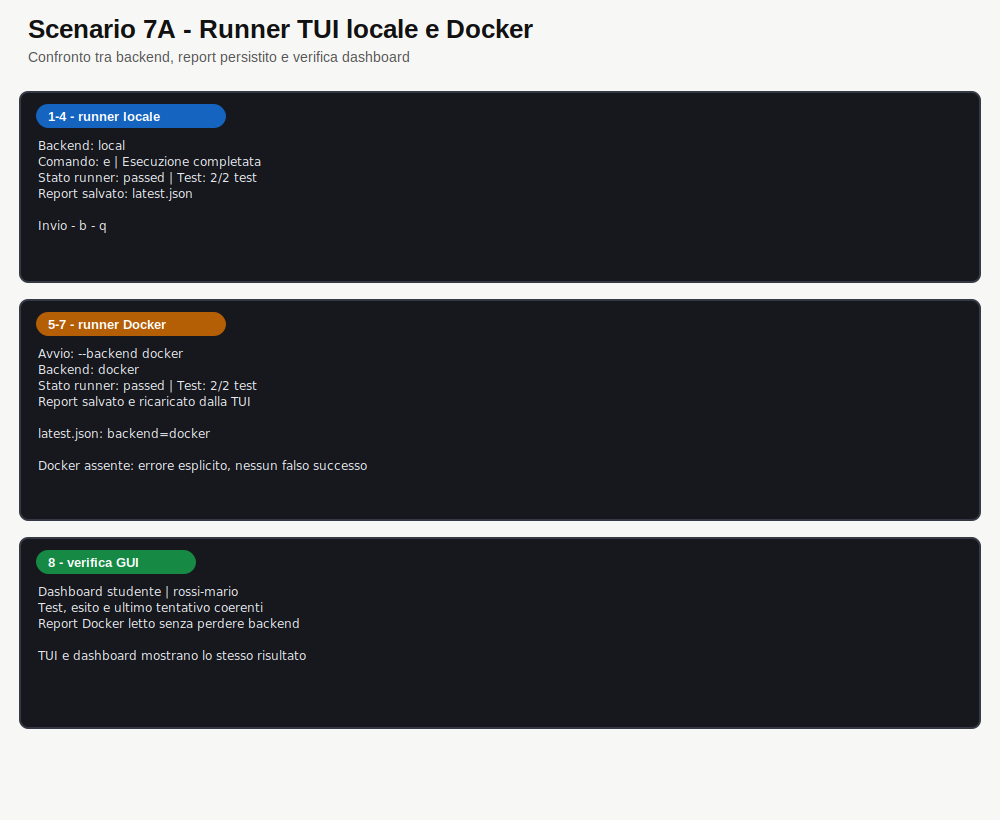

</td><td valign="top">
<strong style="color:#1464c0">Step 1-4 - Blu: runner locale</strong><br>
Avvia la TUI con <code>--backend local</code>, seleziona la demo, premi <code>e</code> e verifica esecuzione completata,
<code>passed</code>, test <code>2/2</code> e report salvato.<br><br>
<strong style="color:#b45f06">Step 5-7 - Arancione: runner Docker</strong><br>
Riavvia con <code>--backend docker</code>, ripeti l'esecuzione e controlla che il report persistito contenga
<code>backend=docker</code>. Se Docker non e disponibile deve comparire un errore esplicito.<br><br>
<strong style="color:#168a45">Step 8 - Verde: verifica dashboard</strong><br>
Apri la dashboard studente, seleziona <code>rossi-mario</code> e confronta test, esito, ultimo tentativo e report.
</td></tr>
</table>

Obiettivo: verificare che il comando `e` usi davvero il backend scelto all'avvio della TUI e che il
report persistito mantenga lo stesso valore. Questo scenario usa una root separata per non sovrascrivere
la demo corrente.

1. Prepara una root demo dedicata:

   ```powershell
   python scripts/student_lab_demo_setup.py --root tmp/student-lab-docker-demo-20260723
   ```

2. Avvia la TUI con il backend locale:

   ```powershell
   python scripts/student_lab_cli.py --root tmp/student-lab-docker-demo-20260723 --student-id rossi-mario --backend local --no-clear --no-color
   ```

3. Seleziona `Demo somma in Python`, premi `e`, attendi il messaggio `Esecuzione completata`, premi invio,
   poi `b` e `q`.
4. Verifica nel dettaglio che compaiano `Backend: local`, `Stato runner: passed`, `Test: 2/2 test` e
   `Report salvato`.
5. Ripeti i passi 2-4 con il backend Docker:

   ```powershell
   python scripts/student_lab_cli.py --root tmp/student-lab-docker-demo-20260723 --student-id rossi-mario --backend docker --no-clear --no-color
   ```

6. Verifica nel dettaglio che ora compaiano `Backend: docker`, `Stato runner: passed`, `Test: 2/2 test` e
   un nuovo percorso di report.
7. Controlla il report persistito:

   ```powershell
   Get-Content tmp/student-lab-docker-demo-20260723/examples/assignment_tracking/student_repos/rossi-mario/reports/python-demo-somma-001/latest.json
   ```

   Nel JSON il campo `backend` deve valere `docker` dopo l'ultima esecuzione.
8. Apri la dashboard studente, seleziona `rossi-mario` e verifica che test, esito e ultimo tentativo
   corrispondano al report Docker.

Risultato atteso:

- Il backend locale produce `passed` e `2/2 test` nella demo Python.
- Il backend Docker produce lo stesso esito isolando l'esecuzione nel container.
- Il report viene ricaricato dalla TUI e dalla dashboard senza perdere il campo `backend`.
- Se Docker non e disponibile, la TUI mostra un errore esplicito senza dichiarare la consegna superata.

## Scenario 8 - Percorso e calendario studente

Obiettivo: verificare che la vista studente mostri il percorso associato e il calendario in sola lettura.

### Schermata reale annotata

La cattura evidenzia calendario e filtri, percorso e consegne come blocchi distinti. La cattura documenta
il controllo negativo della fixture demo; la procedura include anche una variante positiva riproducibile.

<table>
<tr><td valign="top" width="52%">

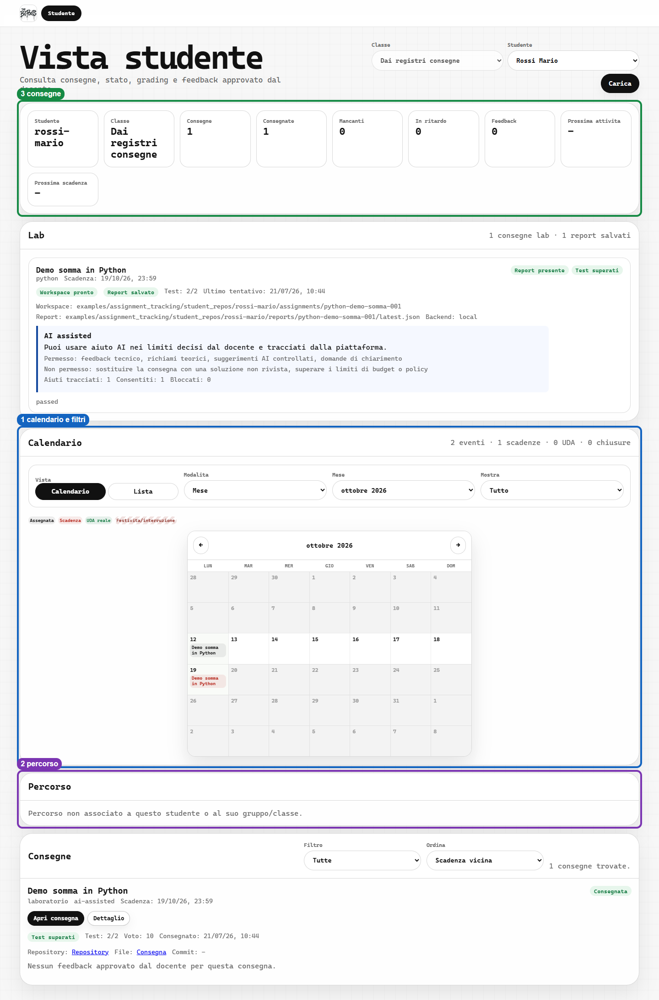

</td><td valign="top">
<strong style="color:#1464c0">Step 1-2, 4-5 - Blu: calendario e filtri</strong><br>
Apri la dashboard, seleziona <code>rossi-mario</code>, carica, scegli modalità, mese e filtro e prova lista/calendario.<br><br>
<strong style="color:#7b35b2">Step 3 - Viola: percorso</strong><br>
Controlla i percorsi associati e apri un paragrafo senza possibilità di modifica.<br><br>
<strong style="color:#168a45">Step 6 - Verde: consegne</strong><br>
Confronta attività, scadenze, stato e distinzione tra consegna, UDA e interruzione.
</td></tr>
</table>

1. Apri `http://localhost:8765/tools/student_dashboard.html`.
2. Seleziona `rossi-mario`.
3. Controlla il pannello del percorso.
4. Passa alla vista calendario, se disponibile.
5. Prova i filtri di visualizzazione.
6. Prova la vista lista e la vista calendario.

Per verificare anche l'associazione positiva, ripeti il test con una seconda preparazione della root demo:

1. Ferma il server con `Ctrl+C`.
2. Copia `doc/images/dashboard-guides/scenario-8-positive-course-design.json` in
   `tmp/student-lab-demo/doc/course_design.json`, sostituendo il file presente.
3. Riavvia il server sulla stessa root e ricarica la dashboard.
4. Seleziona di nuovo `rossi-mario` e controlla il pannello del percorso.

La fixture positiva associa `demo-percorso-3a` alla classe `3A-TPSI`. Per tornare al caso negativo,
esegui di nuovo `python scripts/student_lab_demo_setup.py` e riavvia il server.

Risultato atteso:

- Nella fixture demo lo studente vede il messaggio `Percorso non associato`.
- Nella fixture positiva lo studente vede `Percorso demo 3A` e la relativa UDA, perché la classe `3A-TPSI` e associata.
- Un percorso associato a un'altra classe non deve essere mostrato allo studente.
- I paragrafi del percorso sono cliccabili e puntano alla pagina GitHub con ancora del paragrafo.
- Il calendario e in sola lettura.
- Consegne, UDA reali, UDA programmate e interruzioni sono distinguibili.
- Le interruzioni usano lo sfondo a strisce salmone/bianco.

## Scenario 9 - Percorso docente

### Schermata reale annotata

La cattura parte dal repository corrente senza progetto caricato: e utile per verificare lo stato iniziale.

<table>
<tr><td valign="top" width="52%">

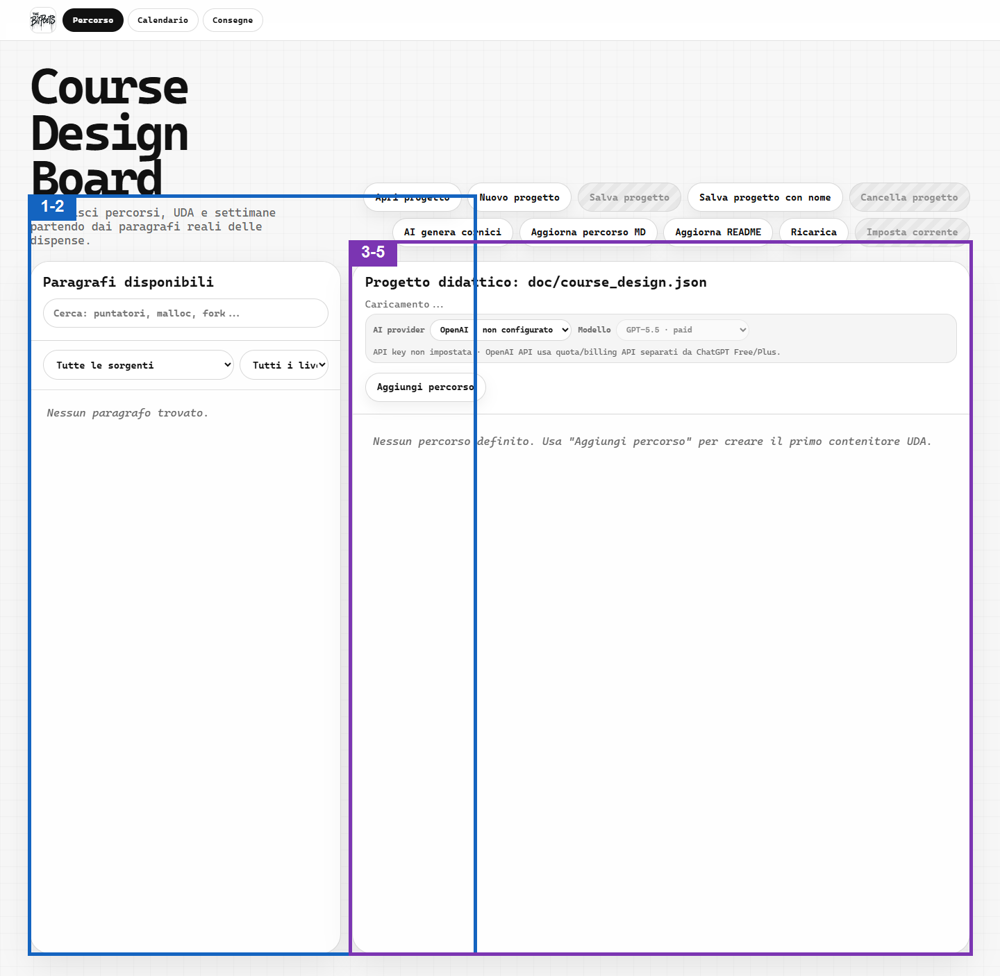

</td><td valign="top">
<strong style="color:#1464c0">Step 1-2 - Blu: catalogo</strong><br>
Apri <code>course_board.html</code> e usa ricerca, sorgenti e livelli del catalogo.<br><br>
<strong style="color:#7b35b2">Step 3-5 - Viola: progetto</strong><br>
Crea o apri il progetto, aggiungi un percorso e inserisci paragrafi nelle UDA.<br><br>
<strong style="color:#c87800">Step 6-8 - Arancione: azioni</strong><br>
Prova salva, ricarica, generazione AI e annullamento; ogni stato deve avere feedback visibile.
</td></tr>
</table>

Obiettivo: verificare creazione, modifica, persistenza, protezione dagli errori, dialog grafici e accessibilità
della pagina Percorso. Nessun passaggio deve aprire i dialog nativi del browser (`alert`, `confirm` o `prompt`).

1. Ferma con `Ctrl+C` il server dello Scenario 7, se ancora attivo. Avvia quindi il server senza root demo,
   usando i dati del repository:

   ```powershell
   python scripts/course_board_server.py
   ```

2. Apri `http://localhost:8765/tools/course_board.html` e autenticati con le credenziali stampate dal server.
3. Usa `Nuovo progetto`. Nel dialog di conferma premi `Esc` e verifica che il progetto corrente non cambi.
   Riaprilo, conferma, lascia vuoto il nome e verifica l'errore inline; inserisci infine
   `test-manuale-percorso.json` e crea il progetto.
4. Aggiungi un percorso con settimane e ore valide. Prova poi a crearne uno con `0` settimane e verifica il bordo rosso e il messaggio di errore.
5. Nel catalogo a sinistra usa il pulsante `+` su un paragrafo, poi premilo di nuovo sullo stesso paragrafo.
5a. Clicca il titolo di un paragrafo e poi il comando `Testo`: verifica che si apra il modal con il contenuto completo.
5b. Dentro una UDA ripeti dal titolo e dal comando `Testo`, poi usa `Apri sorgente su GitHub` e verifica l'ancora del paragrafo.
6. Modifica una cornice e premi `Ricarica`: nel dialog grafico premi `Resta qui` e verifica che la modifica
   resti visibile e che il focus torni al comando precedente. Ripeti accettando `Scarta modifiche` e verifica
   che torni l'ultimo stato salvato.
7. Usa `Salva progetto con nome` indicando di nuovo `test-manuale-percorso.json`: nel dialog grafico
   annulla la sovrascrittura e verifica che l'archivio precedente non cambi. Riprova e conferma per proseguire.
8. Salva regolarmente il progetto. Se il provider AI è configurato, genera una sola cornice, avvia una nuova coda e usa `Annulla`; verifica che testo e indicatori di qualità tornino allo stato iniziale.
9. Usa soltanto la tastiera per raggiungere il catalogo e aggiungere un paragrafo con il pulsante `+`.
10. Restringi la finestra a circa `390 px`: pannelli, titoli, campi e pulsanti devono restare leggibili senza sovrapporsi.
11. Cancella `test-manuale-percorso.json` dalla board per ripulire i dati di prova. Verifica che il dialog
    mostri chiaramente titolo, conseguenze, `Mantieni` e il comando distruttivo evidenziato; annulla una volta
    prima di confermare davvero.

Risultato atteso:

- I dati non validi non entrano nel progetto.
- Lo stesso paragrafo non viene duplicato nello stesso percorso.
- Il titolo e il comando `Testo` aprono il modal con contenuto, fonte, riga e link GitHub coerenti.
- Ricarica e navigazione non scartano modifiche senza conferma.
- Un nome già esistente richiede conferma prima della sovrascrittura.
- I dialog sono integrati nella pagina, si chiudono con `Esc`, ripristinano il focus e mostrano gli errori
  obbligatori accanto al campo senza bloccare il browser o l'automazione Playwright.
- Le azioni distruttive hanno un comando esplicito e visivamente distinto; l'annullamento non modifica dati.
- L'annullamento AI ripristina sia il testo sia gli indicatori di qualità.
- I comandi essenziali sono raggiungibili da tastiera e restano usabili su mobile.

## Scenario 10 - Calendario docente

### Schermata reale annotata

La cattura mostra la vista iniziale del calendario con le date obbligatorie ancora da impostare.

<table>
<tr><td valign="top" width="52%">

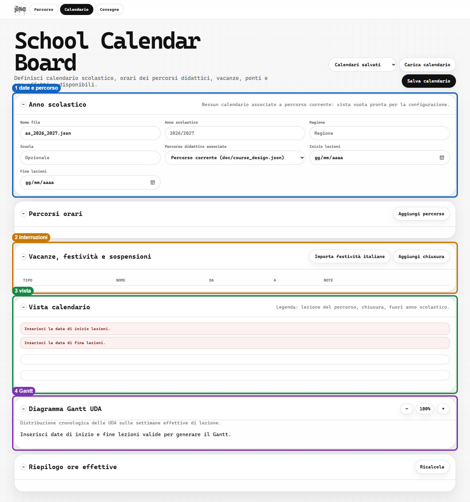

</td><td valign="top">
<strong style="color:#1464c0">Step 1-2 - Blu: calendario e date</strong><br>
Apri <code>school_calendar.html</code>, carica o crea un calendario e imposta inizio/fine lezioni.<br><br>
<strong style="color:#c87800">Step 4 - Arancione: interruzioni</strong><br>
Aggiungi o importa festivita e sospensioni e verifica che siano distinguibili.<br><br>
<strong style="color:#168a45">Step 3, 6-7 - Verde: vista calendario</strong><br>
Salva il calendario, prova modalita, frecce e filtri senza perdere dati.<br><br>

<strong style="color:#7b35b2">Step 5 - Viola: Gantt</strong><br>
Controlla che le UDA compaiano nel Gantt quando sono presenti.
</td></tr>
</table>

Obiettivo: verificare che il calendario docente resti coerente con il percorso e con la dashboard studente.

1. Con il server dello Scenario 9 ancora attivo, apri `http://localhost:8765/tools/school_calendar.html`.
2. Seleziona il percorso salvato nello Scenario 9, oppure crea un calendario di prova associato a
   `test-manuale-percorso.json`.
3. Imposta inizio e fine delle lezioni e salva il calendario.
4. Aggiungi almeno una festivita o sospensione con intervallo di date e salva di nuovo.
5. Se il percorso contiene UDA programmate o reali, verifica che compaiano nel calendario e nel Gantt.
   Se non sono presenti, annota esplicitamente il dato come prerequisito non disponibile invece di
   considerare superato il controllo.
6. Prova modalità `settimana`, `mese` e `anno`.
7. Prova frecce avanti/indietro e filtri visibili, verificando che interruzioni e UDA restino distinguibili.

Risultato atteso:

- La grafica resta coerente con lo stile morbido del calendario docente.
- Il calendario mantiene le date salvate e il percorso associato dopo ricarica.
- I filtri non nascondono dati senza indicarlo.
- Le UDA reali e programmate sono distinguibili quando presenti.
- Le interruzioni sono visibili e non si confondono con consegne mancanti.

## Template per nuovi scenari

Usa questo formato quando aggiungi una prova manuale:

```text
## Scenario N - Titolo

Obiettivo:

Prerequisiti:

Passi:
1. ...
2. ...

Dati da selezionare:

Risultato atteso:

Regressioni da controllare:
```
