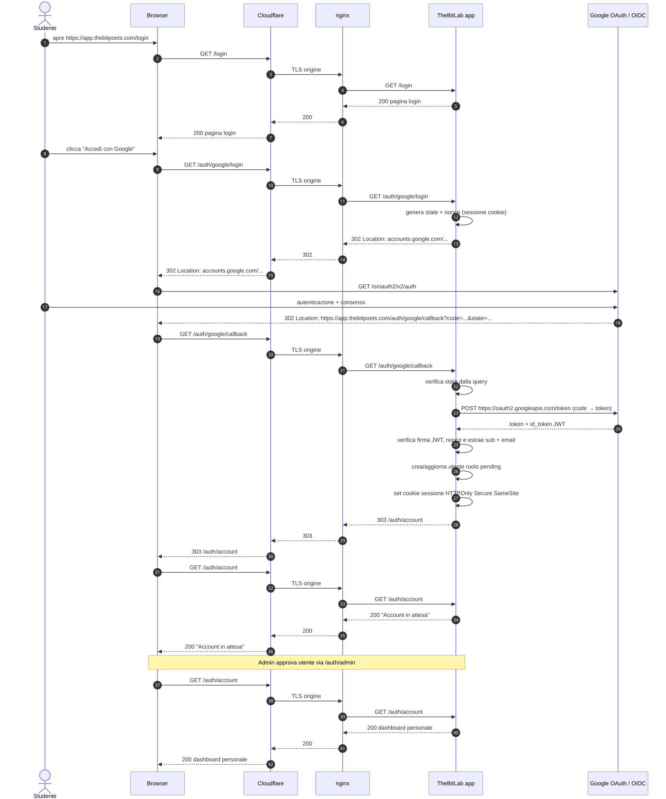
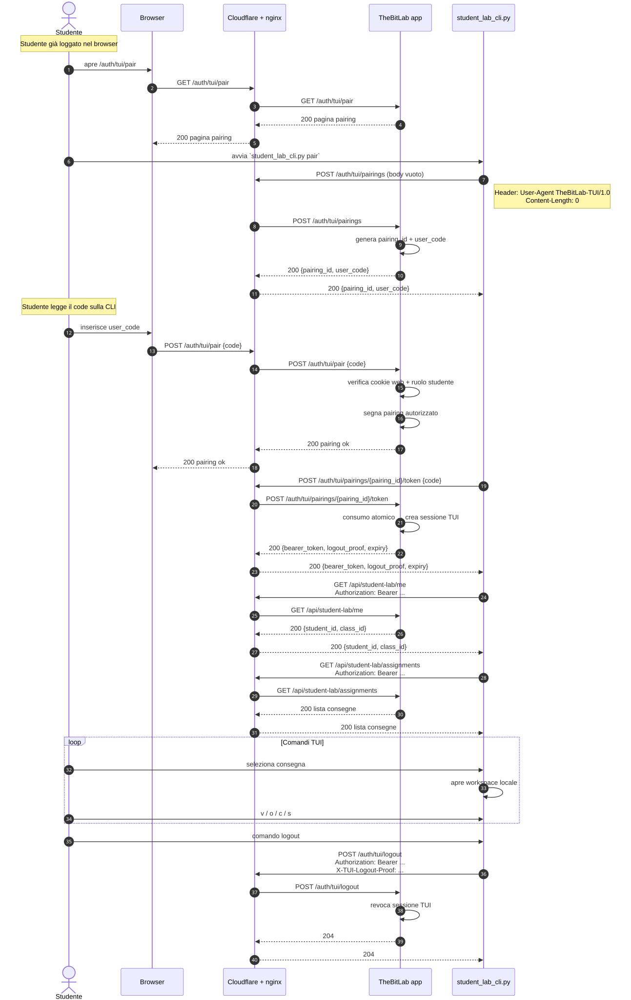
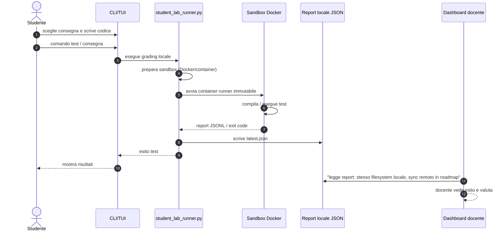

# TheBitLab — Diagrammi d'architettura

Questo documento raccoglie le viste visive dell'architettura TheBitLab. I sorgenti dei diagrammi sono i file `.mmd` in [`doc/architecture/diagrams/`](diagrams/); le immagini `.svg` vengono generate da quelli e versionate per comodità di lettura.

> **Fonte della verità**: [`doc/architecture/diagrams/*.mmd`](diagrams/). Se modifichi un diagramma, rigenera gli SVG con lo script e committa anche le immagini aggiornate.

---

## Come rigenerare le immagini

Richiede Node.js 20+ e npx:

```bash
bash scripts/render_architecture_diagrams.sh
```

Lo script usa `@mermaid-js/mermaid-cli` in una versione pinnata (file [`diagrams/.mmd-version`](diagrams/.mmd-version)). Rimuove automaticamente gli SVG orfani per cui non esiste più il sorgente `.mmd`.

> **Nota**: `mermaid-cli` può produrre output leggermente diverso tra OS per font/layout. Gli SVG committati sono quelli generati in ambiente Linux; se rigeneri in locale su Windows/macOS, verifica che i file committati siano bit-identici o usa il risultato del CI come riferimento.

---

## 1. Vista di contesto

Attori e sistemi esterni che interagiscono con TheBitLab.

[](diagrams/mega-overview.mmd)

---

## 2. Deployment e infrastruttura

Cloudflare edge, VPS Hetzner, rete, storage, segreti e monitoraggio.

[](diagrams/deployment-infrastructure.mmd)

---

## 3. Flusso di login Google (OIDC)

Dal click su "Accedi con Google" alla dashboard personale, passando per `state`/`nonce`, token JWT e approvazione admin.

[](diagrams/auth-google-oidc.mmd)

---

## 4. Pairing TUI browser ↔ terminale

La CLI richiede un pairing, il browser lo autorizza, il terminale riceve il bearer e accede alle API studente.

[](diagrams/tui-pairing-flow.mmd)

---

## 5. Grading di un tentativo

Esecuzione locale del codice studente in sandbox Docker, scrittura del report e lettura da parte della dashboard docente.

[](diagrams/grading-flow.mmd)

---

## Riferimenti

- [Architettura discorsiva MVP](../ARCHITETTURA_MVP.md)
- [Infrastruttura produzione](../INFRASTRUTTURA_PRODUZIONE.md)
- [Route HTTP TUI pairing](tui-pairing-http-routes.md)
- [Route HTTP Google OIDC](google-oidc-http-routes.md)
- [Autorizzazione dashboard](dashboard-authorization.md)
