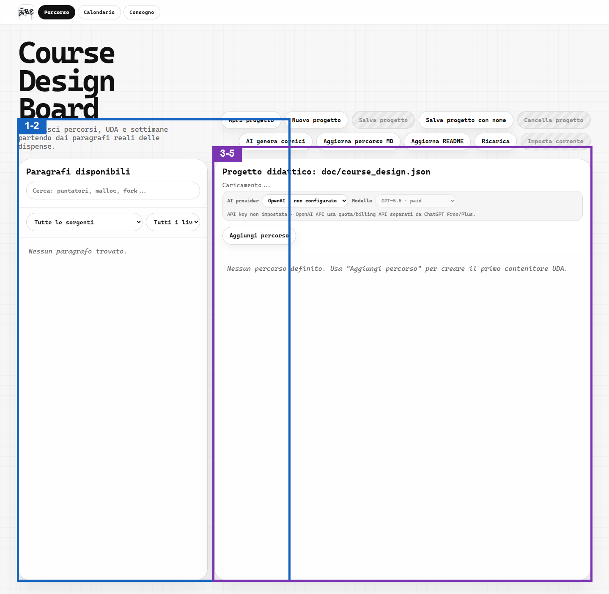

# Fonte di collaudo per il percorso docente

Questa fixture contiene paragrafi e riferimenti immagine controllati per lo Scenario 9. Non sostituirla con contenuti didattici reali durante il collaudo.

## Paragrafo da aggiungere alla UDA

Testo completo del paragrafo usato per verificare catalogo, inserimento, deduplicazione e modal `Testo`.

## Immagine locale valida

L'immagine seguente deve essere servita dalla stessa root della fonte e restare confinata nel modal.

## Immagine locale mancante

Il contenuto deve restare leggibile e mostrare il fallback testuale.

## Immagine fuori dalla root

Il riferimento seguente deve essere respinto senza leggere file esterni alla root configurata.

## Immagine con URL esterno

Il riferimento seguente deve essere respinto senza richieste di rete.

## Immagine con estensione non grafica

Il riferimento seguente deve essere respinto prima di tentare la lettura.

